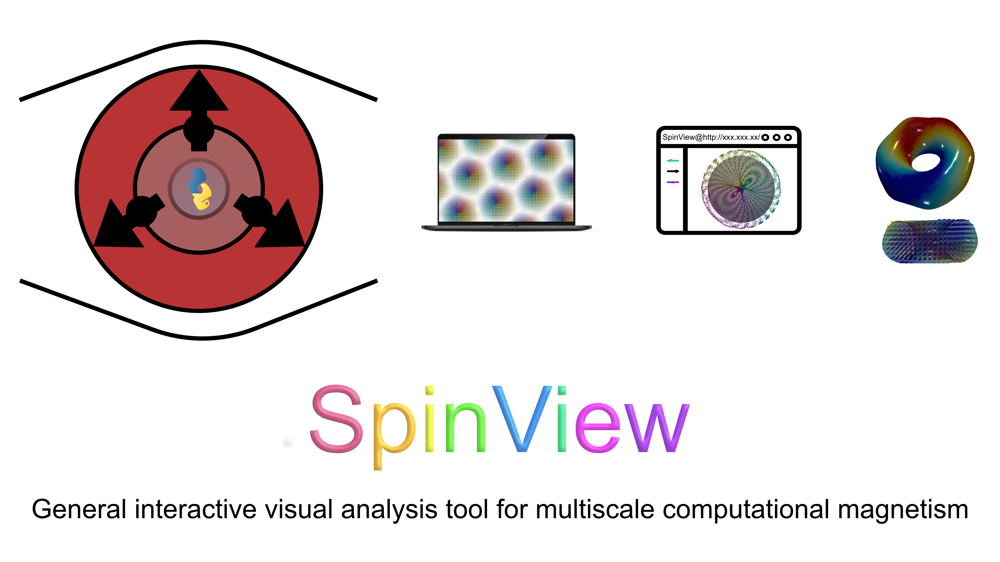

    <b>
      <a href="https://mxjk851.github.io/SpinView/">Website</a> &nbsp;
      • &nbsp;
      <a href="https://mxjk851.github.io/SpinView/quick_object_change/">Feature documentation</a> &nbsp;
      • &nbsp;
      <a href="https://arxiv.org/abs/2309.17367">Cite our paper</a> &nbsp;
      • &nbsp;
      <a href="">Join the slack</a> &nbsp;
    </b>

SpinView is a general interactive visual analysis tool developped for multiscale computational magnetism that allow users with interdisciplinary backgrounds to simplified thier own workflow, speeds up
analysis of complex datasets and trajectories, and enables new types of analysis.

The key features are:

* **User friendly**: Enjoy the combination of Command-line-interface, WebUI and DesktopUI
* **Post-processing**: Denoising, Clip, Rescaling, try the visual exploration and data mining with SpinView!
* **Feature-rich 3D visualization**: Visualize your simulation result with glyphs, e.g., sphere, cone, arrow, plane, box, and any 3D models generated by yourself. Overlap everything including recontructed mesh and isosurface.
* **Extendable**: Currently support .out (UppASD), Non-binary .ovf (Mumax3, OOMMF, Spirit), and .data (Vampire) output files and can easiy extend to other magnetic simulation code.
* **Shareable**: Take snapshoot, rendering a trajectory video, make a protable interactive HTML file with only one click!
* **Community support**: Open-source (GPL V3) and free to use, based on Python, Pandas, Numpy, Scipy, Trame, and Pyvista.

# Installation 

## 1. Installing SpinView with conda virtual environment.

* To install `miniconda` please follow the instructions [here](https://docs.conda.io/en/latest/miniconda.html).

* To install `Anaconda` please follow the instructions [here](https://docs.anaconda.com/anaconda/install/).

## 2. Create a new conda environment for SpinView using the following command:

`$ conda create -n spinview python=3.9`

## 3. Install SpinView using the following command:

`$ conda activate spinview`

`$ pip install spinview`

Note that user in `China mainland` may need to add a pip source to make sure you can easily download all packages. (add `-i https://pypi.tuna.tsinghua.edu.cn/simple`)

`$ pip install spinview  -i https://pypi.tuna.tsinghua.edu.cn/simple`

## 4. launch SpinView in simulation folder under auto mode using the following command:
To take advantage of auto parser module, please make sure you are in the simulation folder, e.g.,
`cd simulation_folder`

`$ spinview start`

or you can give the absolute path of the simulation folder

`$ spinview start -wp abs_path_of_simulation_folder`

Note: it will be a little bit slow from cold start, please wait for a while. 

# Question and Contributing:

We are happy to answer any questions you may have. SpinView also welcomes any contributions and collaboration to make it better. Please feel free to contact us via email or Slack. 

## More information can be find in our <a href="https://mxjk851.github.io/SpinView/">Website</a>.

